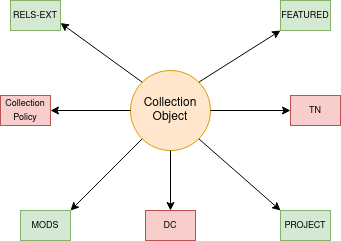

Collection
==========

About
-----

In our current repository, digital collections have a specific content model. These collections contain other objects
and in some cases other collections.

The Model and Its Binaries
--------------------------

A standard collection object looks like this:

The items in greene have significance to future migrations while the ones in red do not.  Each are described below:

* **RELS_EXT** explains what the object is and how it relates to other objects in the repository.  The file is written in RDF XML and always points "up."  In other words, the collection would point at the collection it is in but not towards the collections it contains.
* **Collection Policy** is used in some way by Islandora (we're not sure how) but serves no significance to us in the future.
* **MODS** contains our desciptive metadata.  Its relationship to RDF and linked data is described in our `https://utk-mods-to-rdf.readthedocs.io/en/latest/>`_.
* **DC** is generated from our **MODS**.  It is useful to the current Fedora API but is not significant for migration.
* When present, **PROJECT** contains files significant to the digital collection.  This can include a number of things included important docs related to rights or provenance.
* **TN** is the thumbnail that is used by the collection. It is significant for migration. *This could be wrong for this Content model.*
* **FEATURED** is a curated image that represents to collection. It is significant to migration.

Identifying via RELS-EXT
------------------------

A collection object can be determined by the contents of its RELS-EXT datastream.

.. code-block:: turtle
    :emphasize-lines: 6

    @prefix ns0: <info:fedora/fedora-system:def/relations-external#> .
    @prefix ns1: <info:fedora/fedora-system:def/model#> .

    <info:fedora/collections:acwiley>
      ns0:isMemberOfCollection <info:fedora/digital:collections> ;
      ns1:hasModel <info:fedora/islandora:collectionCModel> .

Collection objects have a :code:`<info:fedora/fedora-system:def/model#hasModel>` of :code:`<info:fedora/islandora:collectionCModel/>`.
