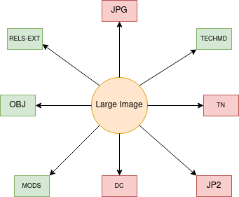

Large Image
===========

About
-----

Large image is the content model that UT Libraries uses to serve and preserve image objects that require a "zoom and pan"
viewer for user display. Other than pages, this is the most common type of object that we serve. Large images can be a
part of a collection or compound object but never a book.  A large image that is part of a compound object has its own
distinct metadata that describes unique things about it from other parts of the compound object.

As of February 4, 2021, the Libraries has :code:`37471` large image objects.

The Model and Its Binaries
--------------------------

A standard large image object looks like this:

* **RELS-EXT** explains what the object is and how it relates to other objects in the repository.  The file is written in RDF XML and always describes its relationships to other digital objects it is a part of.
* **OBJ** is the preservation object. This is the most critical binary here.
* **MODS** contains our descriptive metadata.  Its relationship to RDF and linked data is described in our `UTK MODS to RDF documentation<https://utk-mods-to-rdf.readthedocs.io/en/latest/>`_.
* **DC** is generated from our **MODS** on ingest based on a transform we supply.  It is useful to the current Fedora API but is not significant for migration.
* **TN** a thumbnail.  Normally, this is generated automatically from the preservation object on ingest. This is not significant to our migration.
* **JP2** a lossy JP2 generated from the OBJ to make the viewing experience more performant. This is not significant to our migration.
* **JPG** a JPG that is generated from the preservation object on ingest.  This is not significant to our migration.
* **TECHMD** is a FITS generated XML file based on the preservation object (OBJ). Ideally, this would be triples in a :code:`fedora:Resource` (maybe on the file rather than the object) in our next system.

Identifying via RELS-EXT
------------------------

A standard large image object has RDF that describes it and its relationship to other objects.  It always has a
:code:`<info:fedora/fedora-system:def/model#hasModel>` of :code:`info:fedora/islandora:sp_large_image_cmodel` like this:

.. code-block:: turtle
    :emphasize-lines: 6

    @prefix ns0: <info:fedora/fedora-system:def/relations-external#> .
    @prefix ns1: <info:fedora/fedora-system:def/model#> .

    <info:fedora/adams:82>
      ns0:isMemberOfCollection <info:fedora/gsmrc:adams> ;
      ns1:hasModel <info:fedora/islandora:sp_large_image_cmodel> .

As stated previously, large images can be parts of compound objects.  When they are, they have triples that look like this:

.. code-block:: turtle
    :emphasize-lines: 6,8

    @prefix ns0: <info:fedora/fedora-system:def/relations-external#> .
    @prefix ns1: <info:fedora/fedora-system:def/model#> .
    @prefix ns2: <http://islandora.ca/ontology/relsext#> .

    <info:fedora/100201:7>
      ns0:isConstituentOf <info:fedora/pcard00:100201> ;
      ns1:hasModel <info:fedora/islandora:sp_large_image_cmodel> ;
      ns2:isSequenceNumberOfpcard00_100201 "2" ;
      ns0:isMemberOfCollection <info:fedora/gsmrc:pcard00> .

As you can see above, the RDF states that the large image :code:`info:fedora/100201:7` is a
:code:`<info:fedora/fedora-system:def/relations-external#isConstituentOf>` the compound object :code:`<info:fedora/pcard00:100201>`.
It also has a :code:`<http://islandora.ca/ontology/relsext#isSequenceNumberOfpcard00_100201>` of :code:`2` indicating
that it should be sorted in second position (our indexes start at 1 not 0). Compound objects are discussed in greater
detail elsewhere in the document.
