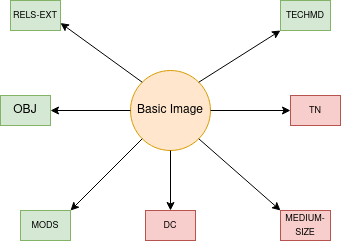

Basic Image
===========

About
-----

In the case of a few legacy collections, the Libraries has a few objects with the content model of "basic image." The
biggest difference between this content model and a large image is that it is not served in an image viewer. Instead,
the static image file is displayed in an :code:`img` tag.

As of February 4, 2021, the Libraries has :code:`9620` basic image objects.

The Model and Its Binaries
--------------------------

A standard basic image looks like this:

* **RELS-EXT** explains what the object is and how it relates to other objects in the repository.  The file is written in RDF XML and always describes its relationships to other digital objects it is a part of.
* **OBJ** is the preservation object. This is the most critical binary here. While the quality here may be very low, it is the best thing we have to represent the object.
* **MODS** contains our descriptive metadata.  Its relationship to RDF and linked data is described in our `https://utk-mods-to-rdf.readthedocs.io/en/latest/>`_.
* **DC** is generated from our **MODS** on ingest based on a transform we supply.  It is useful to the current Fedora API but is not significant for migration.
* **TN** a thumbnail.  Normally, this is generated automatically from the preservation object on ingest. This is not significant to our migration.
* **MEDIUM_SIZE** a JPG that is generated from the OBJ on ingest.  This is not significant to our migration.
* **TECHMD** is a FITS generated XML file based on the preservation object (OBJ). Ideally, this would be triples in a :code:`fedora:Resource` (maybe on the file rather than the object) in our next system.

Identifying via RELS-EXT
------------------------

A standard basic image object has RDF that states the collection(s) to which it belongs and its content model:

.. code-block:: turtle
    :emphasize-lines: 6

    @prefix ns0: <info:fedora/fedora-system:def/relations-external#> .
    @prefix ns1: <info:fedora/fedora-system:def/model#> .

    <info:fedora/open:1>
      ns0:isMemberOfCollection <info:fedora/wpatva:open> ;
      ns1:hasModel <info:fedora/islandora:sp_basic_image> .

A basic image always has a triple that states it has a
:code:`<info:fedora/fedora-system:def/model#hasModel>` of :code:`info:fedora/islandora:sp_basic_image`.
