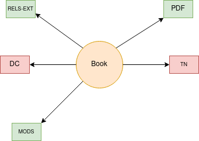
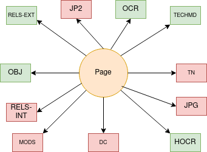

Books and Pages
===============

About
-----

Books are made up of two content models:  a book and a page.  The book is a unique object with its own binaries.  The
page also has its own binaries and has triples that describe its relationship to the book.  The book is served in a
page turning viewer with the pages. The pages can also be viewed in a pan and zoom viewer.

As of February 4, 2021, the Libraries has :code:`15460` books with a total of :code:`320068` pages.

The Book Model and Its Binaries
-------------------------------

A standard book object looks like this:

The book typically has these datastreams:

* **RELS-EXT** explains what the object is and how it relates to other objects in the repository.  The file is written in RDF XML and always describes its relationships to other digital objects it is a part of.
* **MODS** contains our descriptive metadata.  Its relationship to RDF and linked data is described in our `UTK MODS to RDF documentation <https://utk-mods-to-rdf.readthedocs.io/en/latest/>`_.
* **DC** is generated from our **MODS** on ingest based on a transform we supply.  It is useful to the current Fedora API but is not significant for migration.
* **TN** is a thumbnail generated from the first page of a book.  It is not significant to migration.
* **PDF** is a PDF generated from all the pages in a book so that we can provide it for download. This object is significant.

The Page Model and Its Binaries
-------------------------------

A standard page object looks like this:

The page typically has these datastreams:

* **RELS-EXT** explains what the object is and how it relates to other objects in the repository.  The file is written in RDF XML and always describes its relationships to other digital objects it is a part of.
* **MODS** contains descriptive metadata about the page.  This is required by our current system but unwanted in the future as it has no descriptive value.
* **DC** is generated from our **MODS** on ingest based on a transform we supply.  It is useful to the current Fedora API but is not significant for migration.
* **TN** is a thumbnail generated from page.  It is not significant to migration.
* **OBJ** is the preservation object. This is the most critical binary here.
* **JPG** is a JPG generated from the OBJ.  It is not significant to migration.
* **JP2** a lossy JP2 generated from the OBJ to make the viewing experience more performant. This is not significant to our migration.
* **TECHMD** is a FITS generated XML file based on the preservation object (OBJ). Ideally, this would be triples in a :code:`fedora:Resource` (maybe on the file rather than the object) in our next system.
* **OCR** is a OCR file generated from the page for display.
* **HOCR** is an HOCR file generated from the page for display.
* **RELS-INT** is a RDF XML file that contains information about the width and height of the JP2 datastream.  It is not significant to migration since a IIIF image server should provide this information in its response.

For quick reference, this is what the RELS-INT looks like:

.. code-block:: turtle

    @prefix ns0: <http://islandora.ca/ontology/relsext#> .

    <info:fedora/agrtfhs:2296/JP2>
      ns0:width "3262" ;
      ns0:height "4304" .

Identifying a Book
------------------

A standard book object has RDF that states the collection(s) to which it belongs and its content model:

.. code-block:: turtle
    :emphasize-lines: 6

    @prefix ns0: <info:fedora/fedora-system:def/relations-external#> .
    @prefix ns1: <info:fedora/fedora-system:def/model#> .

    <info:fedora/agrtfhs:2292>
      ns0:isMemberOfCollection <info:fedora/collections:agrtfhs> ;
      ns1:hasModel <info:fedora/islandora:bookCModel> .

Identifying a Page
------------------

A standard page object has RDF that states the book to which it belongs and its content model:

.. code-block:: turtle
    :emphasize-lines: 6, 10, 11

    @prefix ns0: <http://islandora.ca/ontology/relsext#> .
    @prefix ns1: <info:fedora/fedora-system:def/relations-external#> .
    @prefix ns2: <info:fedora/fedora-system:def/model#> .

    <info:fedora/agrtfhs:2296>
      ns0:isPageOf <info:fedora/agrtfhs:2292> ;
      ns0:isSequenceNumber "1" ;
      ns0:isPageNumber "1" ;
      ns0:isSection "1" ;
      ns1:isMemberOf <info:fedora/agrtfhs:2292> ;
      ns2:hasModel <info:fedora/islandora:pageCModel> ;
      ns0:generate_ocr "TRUE" ;
      ns0:generate_hocr "TRUE" .

It also describes what page number it is (index starts at 1 and not 0).