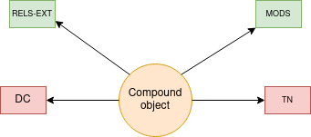

Compound Objects
================

About
-----

Compound objects are made up of multiple content models.  Compound objects normally include large images but not always.
The compound object is a unique object with its own binaries. Objects related to the compound object have its own
binaries and triples that describe its relationship to the compound object. The compound object has its own viewer. The
viewer shows the compound object and its parts.  You can also see any part in its content model's viewer.

The Compound Object and Its Binaries
------------------------------------

A standard compound object looks like this:

* **RELS-EXT** explains what the object is and how it relates to other objects in the repository.  The file is written in RDF XML and always describes its relationships to other digital objects it is a part of.
* **MODS** contains descriptive metadata about the compound object.
* **DC** is generated from our **MODS** on ingest based on a transform we supply.  It is useful to the current Fedora API but is not significant for migration.
* **TN** is a thumbnail generated from the first part of a compound object.  It is not significant to migration.

Identifying a Compound Object
-----------------------------

A standard compound object has RDF that states the collection to which it belongs and its content model:

.. code-block:: turtle
    :emphasize-lines: 6

    @prefix ns0: <info:fedora/fedora-system:def/relations-external#> .
    @prefix ns1: <info:fedora/fedora-system:def/model#> .

    <info:fedora/pcard00:100201>
      ns0:isMemberOfCollection <info:fedora/gsmrc:pcard00> ;
      ns1:hasModel <info:fedora/islandora:compoundCModel> .

A compound object is never a member of another compound object.

A part of a compound object follows its standard content model but has RDF that describes its relationship to the
compound object and its number in the compound object sequence:

.. code-block:: turtle
    :emphasize-lines: 6, 8

    @prefix ns0: <info:fedora/fedora-system:def/relations-external#> .
    @prefix ns1: <info:fedora/fedora-system:def/model#> .
    @prefix ns2: <http://islandora.ca/ontology/relsext#> .

    <info:fedora/100201:8>
      ns0:isConstituentOf <info:fedora/pcard00:100201> ;
      ns1:hasModel <info:fedora/islandora:sp_large_image_cmodel> ;
      ns2:isSequenceNumberOfpcard00_100201 "1" ;
      ns0:isMemberOfCollection <info:fedora/gsmrc:pcard00> .