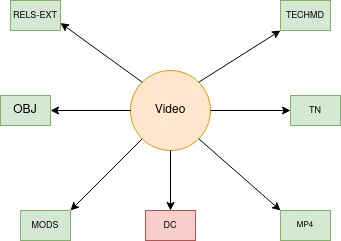

Video
=====

About
-----

Video objects in our repository have an video content model.  The content model is used to preserve video files and
serve them in a player.

The Model and Its Binaries
--------------------------

A standard video object looks like this:

Identifying via RELS-EXT
------------------------

A standard video object has RDF that states the collection(s) to which it belongs and its content model:

.. code-block:: turtle
    :emphasize-lines: 6

    @prefix ns0: <info:fedora/fedora-system:def/relations-external#> .
    @prefix ns1: <info:fedora/fedora-system:def/model#> .

    <info:fedora/wderfilms:10>
      ns0:isMemberOfCollection <info:fedora/gsmrc:wderfilms> ;
      ns1:hasModel <info:fedora/islandora:sp_videoCModel> .

A video object always has a triple that states it has a
:code:`<info:fedora/fedora-system:def/model#hasModel>` of :code:`info:fedora/islandora:sp_videoCModel`.
