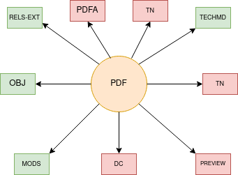

`UTK MODS to RDF documentation<https://utk-mods-to-rdf.readthedocs.io/en/latest/>`_.PDF
===

About
-----

When the original object is a PDF, the PDF content model is used. This content model applies specific actions related to
the preservation of PDFs and its viewing experience.

As of February 4, 2021, the Libraries has :code:`594` pdf objects.

The Model and Its Binaries
--------------------------

A standard pdf object looks like this:

* **RELS-EXT** explains what the object is and how it relates to other objects in the repository.  The file is written in RDF XML and always describes its relationships to other digital objects it is a part of.
* **OBJ** is the original file the object is based on.
* **MODS** contains our descriptive metadata.  Its relationship to RDF and linked data is described in our `UTK MODS to RDF documentation <https://utk-mods-to-rdf.readthedocs.io/en/latest/>`_.
* **DC** is generated from our **MODS** on ingest based on a transform we supply.  It is useful to the current Fedora API but is not significant for migration.
* **TN** a thumbnail.  It is not significant to migration.
* **PDFA** is the preservation object generated from the OBJ. It is more important than the OBJ.
* **TECHMD** is a FITS generated XML file based on the original file (OBJ). Ideally, this would be triples in a :code:`fedora:Resource` (maybe on the file rather than the object) in our next system.* **PREVIEW**
* **FULL_TEXT** is the full text generated from the PDF.
* **PREVIEW** is a JPG generated from the first page of the PDF for viewing.  It is not significant to migration.

Identifying via RELS-EXT
------------------------

A standard PDF object has RDF that states the collection(s) to which it belongs and its content model:

.. code-block:: turtle
    :emphasize-lines: 6

    @prefix ns0: <info:fedora/fedora-system:def/relations-external#> .
    @prefix ns1: <info:fedora/fedora-system:def/model#> .

    <info:fedora/colloquy:201>
      ns0:isMemberOfCollection <info:fedora/gsmrc:colloquy> ;
      ns1:hasModel <info:fedora/islandora:sp_pdf> .

A PDF object always has a triple that states it has a
:code:`<info:fedora/fedora-system:def/model#hasModel>` of :code:`info:fedora/islandora:sp_pdf`.
