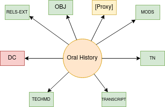

Oral History
============

About
-----

Audio and video content models do not have a viewer that displays its transcript.  For that reason, modern audio and video
files are served in the oral history content model.  These objects have a webVTT file that is rendered in its viewer.

There are currently :code:`13` oral history objects.

The Oral History and Its Binaries
---------------------------------

A standard oral history object looks like this:

* **RELS-EXT** explains what the object is and how it relates to other objects in the repository.  The file is written in RDF XML and always describes its relationships to other digital objects it is a part of.
* **OBJ** is the preservation object.
* **MODS** contains our descriptive metadata.  Its relationship to RDF and linked data is described in our `UTK MODS to RDF documentation <https://utk-mods-to-rdf.readthedocs.io/en/latest/>`_.
* **DC** is generated from our **MODS** on ingest based on a transform we supply.  It is useful to the current Fedora API but is not significant for migration.
* **TN** a thumbnail.  This is normally generated from the OBJ, but not always.
* A Proxy, usually a **PROXY_MP3**.  This is used in the player.  It is sometimes generated from the OBJ automatically, but not always.
* **TECHMD** is a FITS generated XML file based on the preservation object (OBJ). Ideally, this would be triples in a :code:`fedora:Resource` (maybe on the file rather than the object) in our next system.
* **TRANSCRIPT** is a webVTT file that corresponds to the access proxy.

Identifying via RELS-EXT
------------------------

A standard large image object has RDF that describes it and its relationship to other objects.  It always has a
:code:`<info:fedora/fedora-system:def/model#hasModel>` of :code:`info:fedora/islandora:oralhistoriesCModel` like this:

.. code-block:: turtle
    :emphasize-lines: 6

    @prefix ns0: <info:fedora/fedora-system:def/relations-external#> .
    @prefix ns1: <info:fedora/fedora-system:def/model#> .

    <info:fedora/voloh:10>
      ns0:isMemberOfCollection <info:fedora/collections:voloh> ;
      ns1:hasModel <info:fedora/islandora:oralhistoriesCModel> .